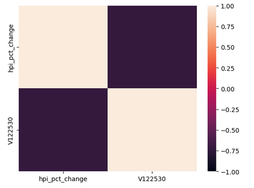

# Ontario Housing Market Analysis
Project 1 for Fintech Bootcamp

### 1a. What are the trends for Ontario real estate for 2005-2023? (Monthly)

### 1b. What are the trends for Ontario real estate for 2005-2023? (Regional)

### 2. How do interest rates affect the housing market in Ontario?

There is a large negative correlation (-0.72) between the percent change of the HPI and the interest rates.

### 3. Where is the housing market trending? 

There is a 95% chance that an initial real estate investment of \\$1,000,000 over the next 10 years will end within in the range of \\$1,661,548.91 and \\$2,690,245.89.